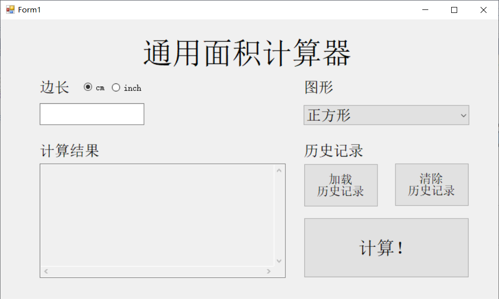
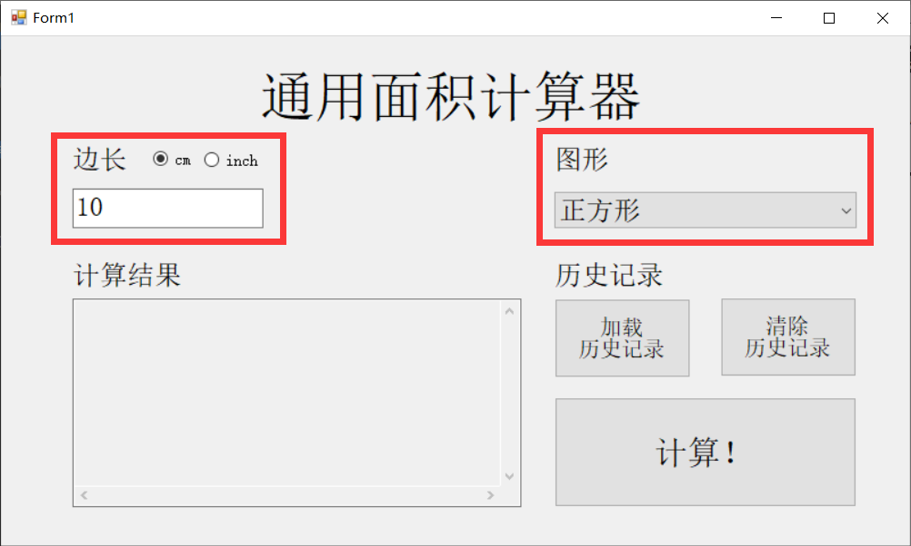
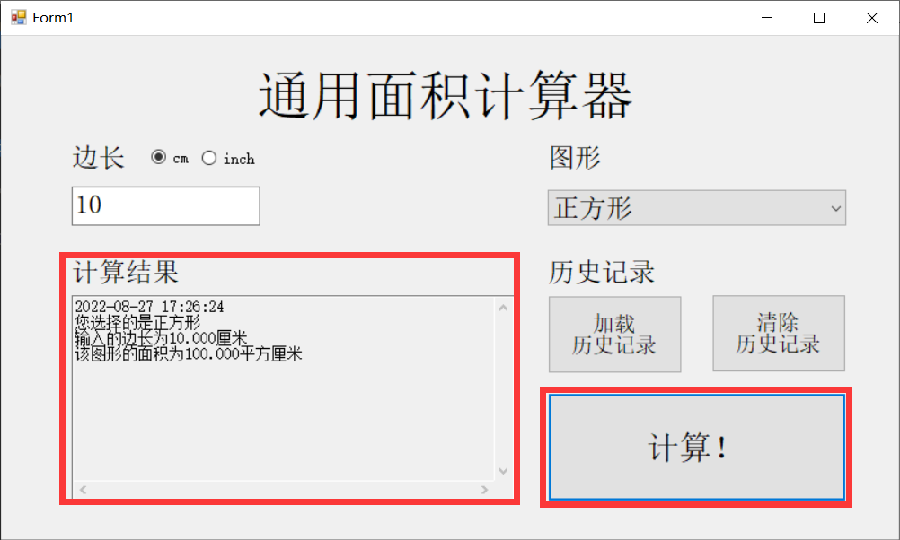
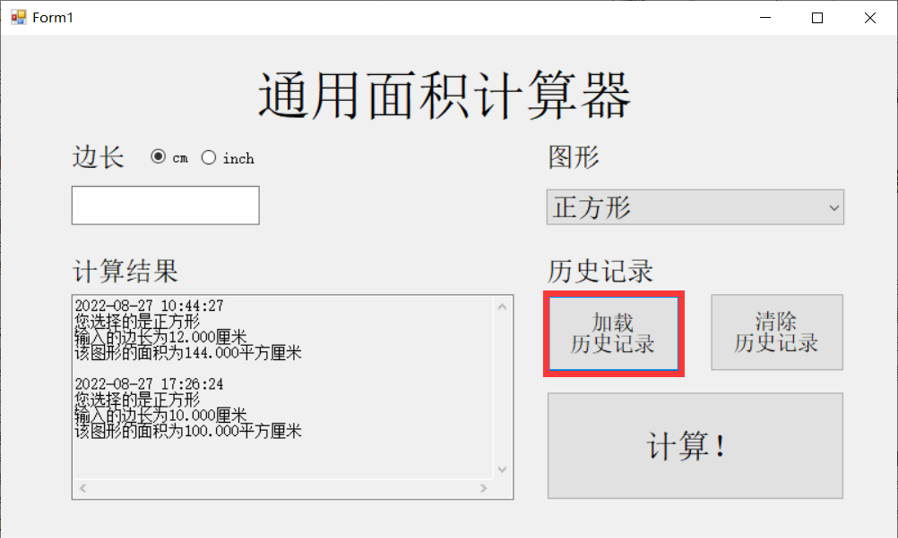
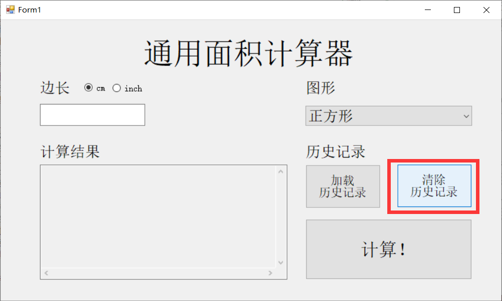

# 通用面积计算器

    该项目为基于C#的通用面积计算器，由涅槃工作室Nirvara Studio开发
    可以计算正方形、长方形、圆形、三角形的面积
    该项目具有易于使用的图形化界面
    选择图案再输入所需参数，即可轻松完成计算，参数可选择厘米和英尺
    此外本项目还具有加载和清除历史记录的功能

   本项目的Github仓库地址为：[https://github.com/Only-Don/General_Area_Calculator](https://github.com/Only-Don/General_Area_Calculator)。
## 目录
- [通用面积计算器](#通用面积计算器)
  - [目录](#目录)
  - [开始](#开始)
  - [使用](#使用)
    - [I. 计算功能：](#i-计算功能)
    - [II. 历史记录功能：](#ii-历史记录功能)
  - [版本](#版本)
  - [作者](#作者)
  - [协议](#协议)
  - [致谢](#致谢)

## 开始
* 依赖项
  * 编程语言：`C#`
  * IDE：`Visual Studio 2022`
  * 运行框架：`.NET`
  * 系统：`Windows`

* 安装流程
  1. 准备好上述依赖项，下载项目文件到本地
  2. 使用`Visual Studio`（推荐2022版）打开项目文件中的sln文件，位于`\General_Area_Calculator\GeneralAreaCalculator` 
  3. 打开Visual Studio，在`调试`菜单中选择`开始调试`，即可开始使用此系统

## 使用
以下是本产品的使用步骤，介绍分为**计算功能**和**历史记录功能**两部分
### I. 计算功能：
1. 打开Visual Studio，在`调试`菜单中选择`开始调试`，运行系统，界面如图所示
   
2. 在右侧`图形`窗口选择需要计算的图形，选中后在左侧`边长`一栏输入边长，根据输入数据的格式选择厘米或者英尺。如图，以正方形为例
   
3. 点击右下角`计算`，即可在左下角`计算结果`框看到结果。
   结果以**厘米**单位输出，附带有**时间戳、输入记录**，便于用户检查。同时支持**直接复制**。
   

### II. 历史记录功能：
1. 加载历史记录：
   在使用过程中用户可能会中途关闭窗口，关闭后却发现还有重要的数据没有记录。
   我们的项目内置了**保存历史记录**的功能，再次打开后点击`加载历史纪录`按钮，即可获取上次计算时的全部历史记录
   
   >**注意：** 使用**清除历史记录**功能之后，就无法加载历史记录了！
2. 清除历史记录：
   在使用过程中可能会产生过多的数据条目，对阅读和使用造成影响。
   此时，只需要点击`清除历史记录`按钮，即可清除全部历史记录。

   >**注意：** 使用**清除历史记录**功能之后，就无法加载历史记录了！
   

## 版本
1.0.0

## 作者
制作团队为**Nirvana Studio**，团队成员如下：

[@Only-Don](https://github.com/Only-Don)（董惟一）：负责GUI设计、数据传入、GUI元件功能触发等程序的编写。

[@ssunet](https://github.com/ssunet)（李桐宇）：负责历史记录的保存和清除功能程序的编写。

[@DreamX01](https://github.com/DreamX01)（邓骁）：负责面积类的编写，处理该项目关于面积的核心计算程序。

[@PortraitA](https://github.com/PortraitA)（秦成宇）：负责美化GUI，未美化前的界面如README.md中图片所示。

[@PotsdamaA](https://github.com/PotsdamA)（王一涵）：由于之前赴上海参加中国大学生游戏开发创作大赛，故此项目主要负责README.md的写作。

## 协议

## 致谢
语法部分主要参考《Visual C#从入门到精通（第9版）》
图形界面部分参考了b站上的一些教程